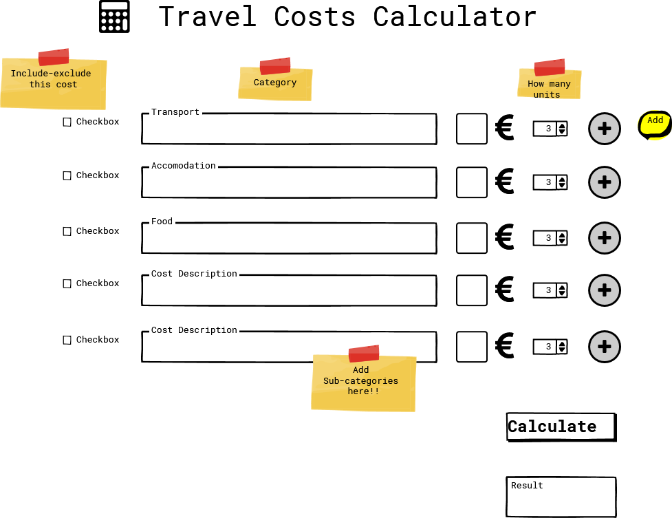

# Mom Calculator

## Life Expenses Budgeting Tool for the Whole Family

Travel expenses as an initial example

## Project Idea

Build a life expenses Calculator
External user’s goal:
The site’s users want to calculate their monthly/yearly expenses.
- The site’s users are interested in gaining insights into data relationships representing particular events or activities.

Site owner's goal:

The site’s goal is to provide a easy-to-use tool to simplify budgeting tasks.
- The site’s goal is to provide easily digestible data representations that lead to user actionable insights.

(EDIT LATER ---> Potential features to include:

Pattern matching functionality
A score tracking system
The ability to play against the computer
A score tracking system
Images to support the correct/incorrect answers
User can create a username
Feedback
Charting functionality to represent the data easily digestible manner
Supporting facts surrounding the data and any insights gleaned from the data)

## Project To Do List

- [ ] LO1	Design an interactive Front-End web application using HTML and CSS and JavaScript based on the principles of user experience design, accessibility and responsivity

- [ ] LO2	Test a front-end web application through the development, implementation and deployment stages

- [x] LO3	Deploy a Front-End web application to a Cloud platform

- [ ] LO4	Maximise future maintainability through documentation, code structure and organisation

- [ ] LO5	Demonstrate and document the development process through a version control system such as GitHub

- [ ] LO6	Implement Front-End interactivity, using core JavaScript, JavaScript libraries or frameworks
- [ ] 
