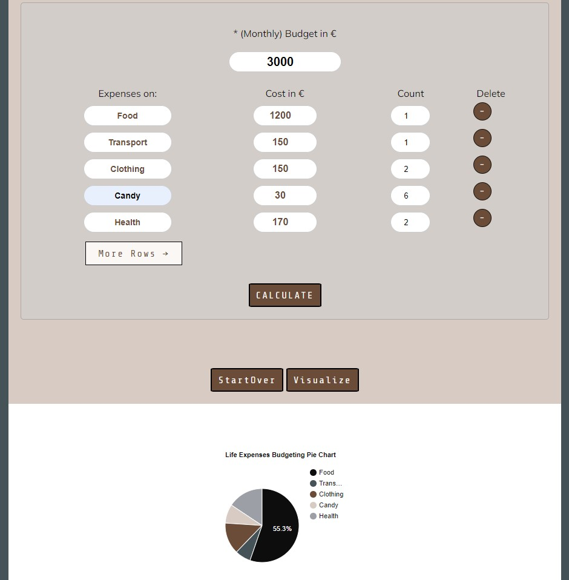

# Mom Calculator

## Life Expenses Budgeting Tool for the Whole Family

# Live View

https://annagabain.github.io/Mom-Calculator/index.html

## Project Idea

Build a life expenses Calculator
External user’s goal:
The site’s users want to calculate their monthly/yearly expenses.
- The site’s users are interested in gaining insights into data relationships representing particular events or activities.

Site owner's goal:

The site’s goal is to provide a easy-to-use tool to simplify budgeting tasks.
- The site’s goal is to provide easily digestible data representations that lead to user actionable insights.

Features include:

- The ability to manupulate numbers
- Colours to support calculation outcome - balance green blue red 
- User can create a username
- Feedback - input results table and listing
- Charting functionality to represent the data easily digestible manner - with google Pie Chart

## Project To Do List

- [x] LO1	Design an interactive Front-End web application using HTML and CSS and JavaScript based on the principles of user experience design, accessibility and responsivity

- [x] LO2	Test a front-end web application through the development, implementation and deployment stages

- [x] LO3	Deploy a Front-End web application to a Cloud platform

- [x] LO4	Maximise future maintainability through documentation, code structure and organisation

- [x] LO5	Demonstrate and document the development process through a version control system such as GitHub

- [x] LO6	Implement Front-End interactivity, using core JavaScript, JavaScript libraries or frameworks

## Contents:

### Features
  -  Title

  

  -  How to Use

  

  -  Username

  

  

  -  Calculator

  

  

  

  -  Results Area

  

  -  Visualization Area

  

  -  (Contact Thank you for Contacting Page)
  -  Footer
  -  404 Error Page

### Development Stages

  -  Planning

  

  -  Layout Creation

 
  
  -  User Experience and User Interface Design UX and UI

  -  Design Scope
     -  Scribbles and Wireframes

  

     -  Colours

### Accessibility and responsivity

  -  Accessibility
  -  Responsivity

### Testing

  -  Validators

  JS

HTML

CSS

    

  -  Remaining Bugs

  
  

### Deployment to GitHub

- GitHub Pages

https://annagabain.github.io/Mom-Calculator/index.html

### Sources & Credits

-   Idea Inspiration

https://www.brutto-netto-rechner.info/

https://statsskuld.se/en/jobs/net-salary

- Tutorials

https://www.youtube.com/watch?v=jV8B24rSN5o

-   Images

Baby hands on kewboard: pexels-karolina-grabowska-4959738

-   Tools

### Acknowledgemts

Jakob Lövhall - for guiding to detect the query selectors necessary for the main functions

Richard Wells - course mentor for feedback on the project

Jamie King - course collegue for helping with the project idea discussions and technical details such as activating es6 in JSHint

David Reynolds - course collegue to check up on the project progress and share similar experiences with JS learning

Fran Boyle - course collegue to inspire and discuss progress