# Mom Calculator

## Life Expenses Budgeting Tool for the Whole Family

Mom Calculator is a website presenting an easy-to use budget calculation tool to family budget keepers. It aims to provide a clear overview on their monthly/yearly expenses to simplify budgeting tasks. Mom Calculator can be useful for any other type of periodic expense calculations as well.

Mom Calculator is a fully-responsive Javascript application. Users can input, modify and manipulate numbers by adding and removing relevant expense categories. The visualisation and results sections represent easily digestible data representations that lead to insights and keeping track of the life costs.

:point_down: Click on the link below for the live view: 

# [View the Live Website](https://annagabain.github.io/Mom-Calculator/index.html)

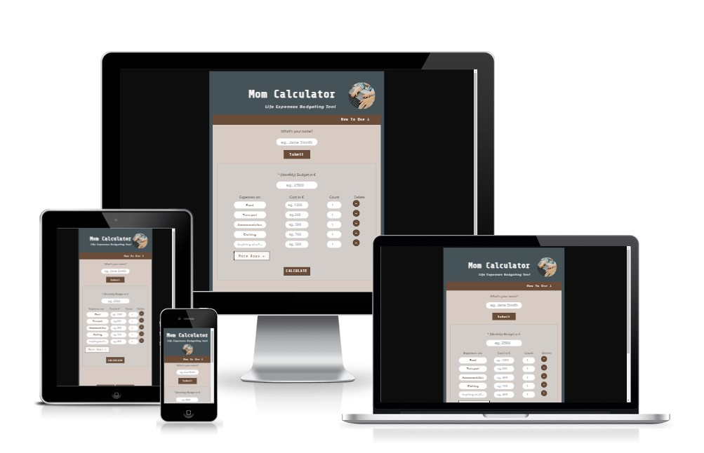

## Contents:
- [Features](#features)
- [Development Stages](#development-stages)
- [Accessibility and Responsivity](#accessibility-and-responsivity)
- [Testing](#testing)
- [Deployment](#deployment)
- [Sources & Credits](#sources--credits)
- [Acknowledgemts](#acknowledgemts)

## Features

### Overview

- User can create a username
- The ability to manupulate numbers
- Feedback - input results table and listing
- Colours to support calculation outcome - balance green blue red 
- Pie Chart to represent the data in easily digestible manner

###  Heading

The heading tells the user what to expect and briefly describes what the calculator does. The medallion image of baby and parent hands on keyboard helps to feel related to the topic - this calculator is a hands on tool to keep track of family finances.

  

###  How to Use

Although using the calclulator is intended to be as streightforward as possible, the How to Use section guides the user step by step through the life expenses calculation process.

  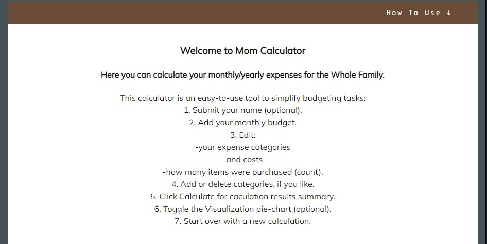

###  Username

Username, or rather User's Name enables the appication to address the user by name. It is a way to make the budgeting journey more personalized. 

  

  This feature is optional and is implemented in greeting the user, shows on the results page and then once again in the thank you for contacting us message.

  

###  Calculator

The main section of the project. The interface is kept as simple as possible to make the user input the major categories necessary for the successful calculation. The input field placeholders, marked light grey guide the user to what type of input is expected. The placeholders represent close-to-life values.

  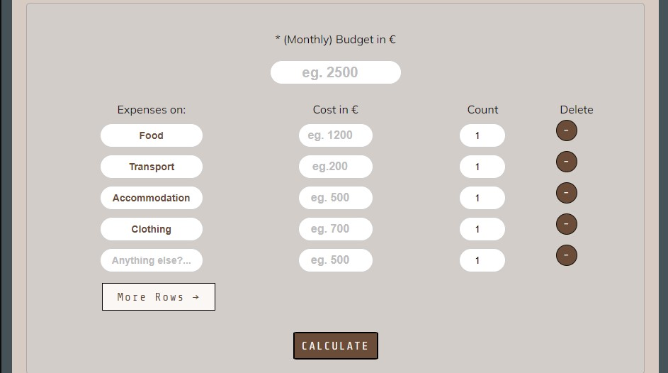

Upon user's input, the placeholder values are replaced with the real once and change the colour from light grey to black-brown to visually show the values are in place. Count values are already present and assigned '1' by default to avoid unnecessary work and attention mistakes. They, offcourse can be modified.

  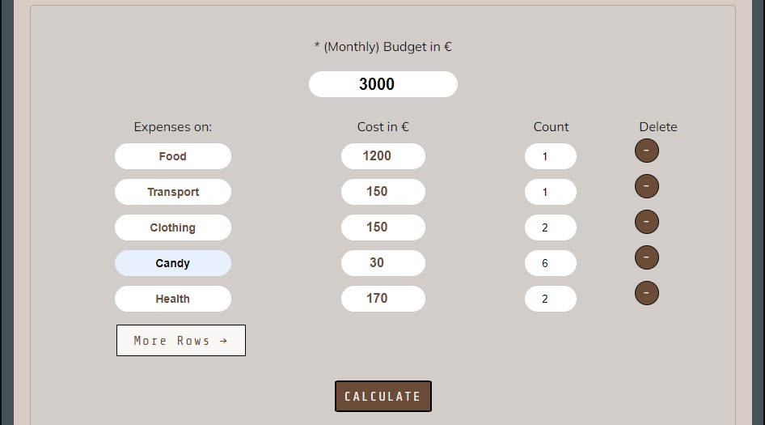

  Right below the calculation area there are two navigation buttons enabling the user to start fresh and visualize the calculation values even before seeing the final total.

  

:point_up_2: [Back to Contents](#contents) 

###  Visualization Area

Visualization Area is toggled and opened onclick. It represents a pie chart with calculation input overall persentage. The pie chart shows what parts of the expense categories take up most of the budget. If toggled before the Calculate button, the user might wish to alterate the inputs based on the chart data.

  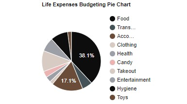

The pie chart is created with Google charts.
https://developers.google.com/chart

###  Results Area

Upon clicking the calculate button, a table is created based on user input values and the summary of the total costs appears on the page. The balance text color indicates a positive, neutral or negative value, depending if the given budget exeeds the costs. 

  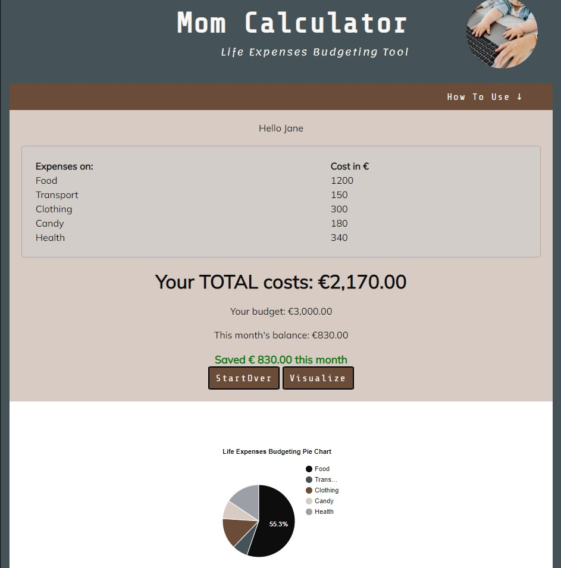

###  Contact form and Thank you for Contacting Area

The contact form is a possibility for the user to leave a feedback on the calculator or ask questions about it. As this project scope does not include working with databases to store the user feedback on servers just yet, therefore the form is merely a placeholder and does not represent any real life contact possibility. 

   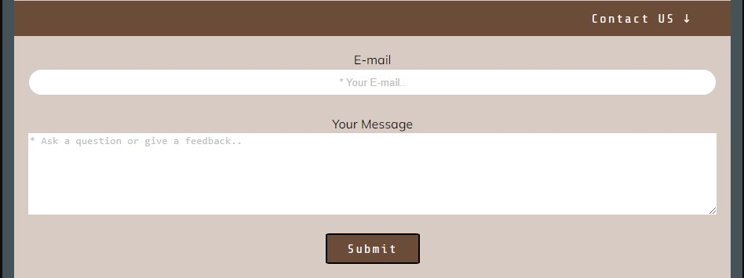

However, upon submission, the user recieves a reassuring (personal) note that their message is recieved.

   

###  Footer

The footer contains a statement of intellectual ownership and more importantly a link to further reading about the Mom Calculator project. The link leads to the present Github page.
   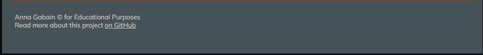

###  404 Error Page

Shows that something went wrong with seeing the website and makes sure the user finds their way back to the Calculator.

   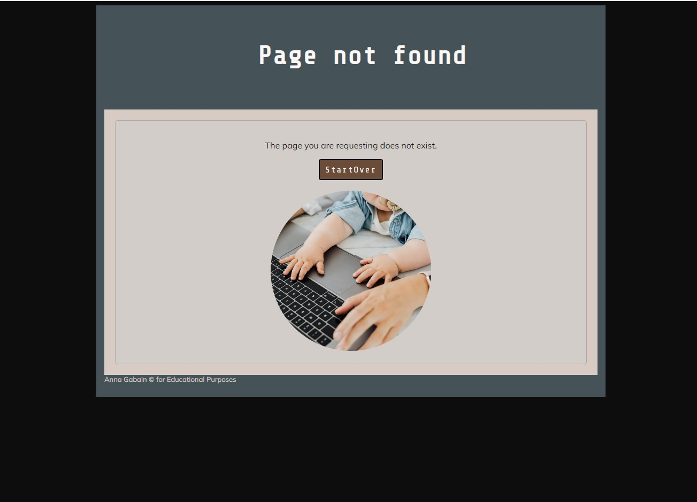

:point_up_2: [Back to Contents](#contents) 

## Development Stages

###  Planning

The project planning began with a research and inspirational ideas on Javascript projects, where creating a calculator appeared the most useful for the target user.

###  User Experience and User Interface Design UX and UI

####  Scribbles and Wireframes

 An initial scribble was created to outline the potential features and look of the application. This look has remained generally valid, with slight alterations during the development process. 

A list of project-vital Javascript functions was created as well as the main visual areas identified.

  

Presented below initial prototype has mostly been preserved, with alteration in font family, calculator width as well as removing the unnecessary complexity with sub-categories

  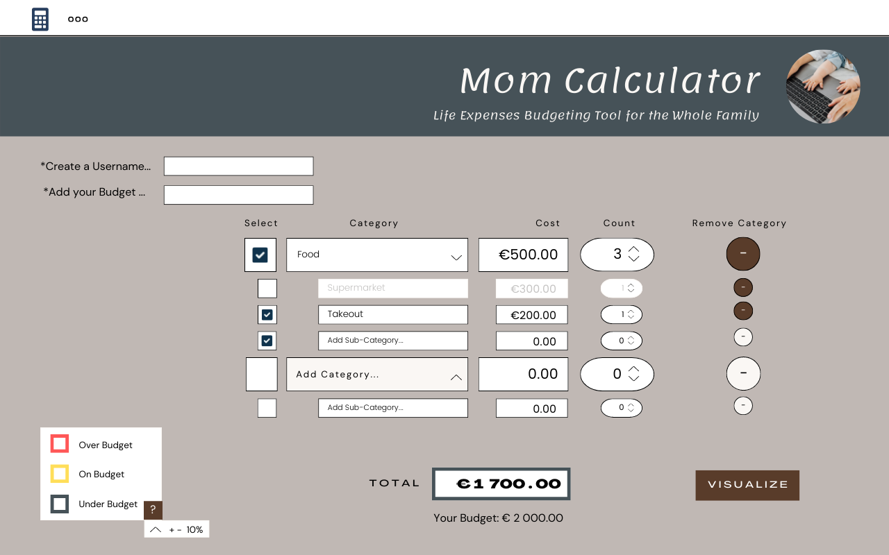

###  Layout Creation

As many users access websites on tablets and mobile devices, extra wireframes were created to ensure the calculator viability early on project.

  
  

####  Colours

Colours and a general moodboeard has been simply taken from the author's previous HTML and CSS project as the focus of the present project is newly obtained Javascript knowledge: https://github.com/annagabain/Mom-Lifehacks

  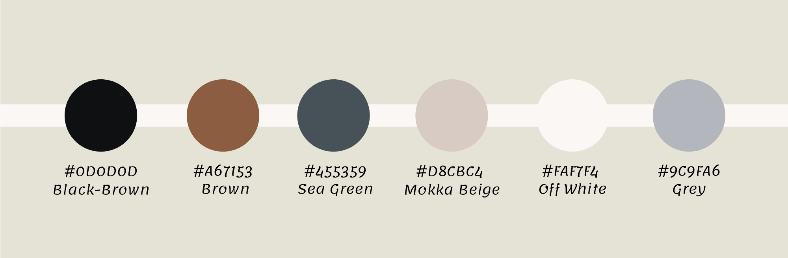

:point_up_2: [Back to Contents](#contents) 

## Accessibility and responsivity

###  Accessibility

Attempst were made to maintain the calculators accessibility by adding alt attributes and labels, where possible. There is, however room for improvement.

  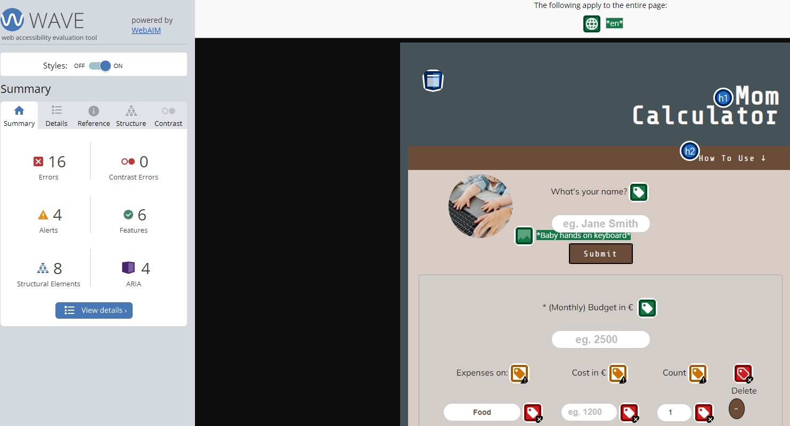

###  Responsivity

Special attention was given to the calculator looking user friendly on a smallest mobile device with 320 px width. The calculation area was adjusted to be responisve to most of the devices screen sizes.

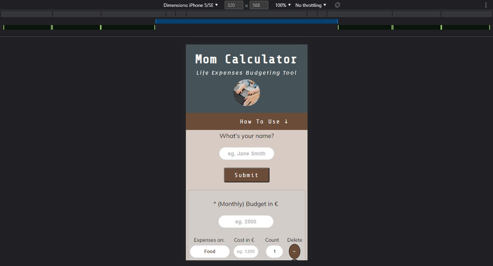

:point_up_2: [Back to Contents](#contents) 

## Testing

###  Validators

JavaScript

The last jshint testing Metrics output:

- There are 18 functions in this file.

- Function with the largest signature take 1 arguments, while the median is 0.

- Largest function has 16 statements in it, while the median is 4.5.

- The most complex function has a cyclomatic complexity value of 5 while the median is 1.

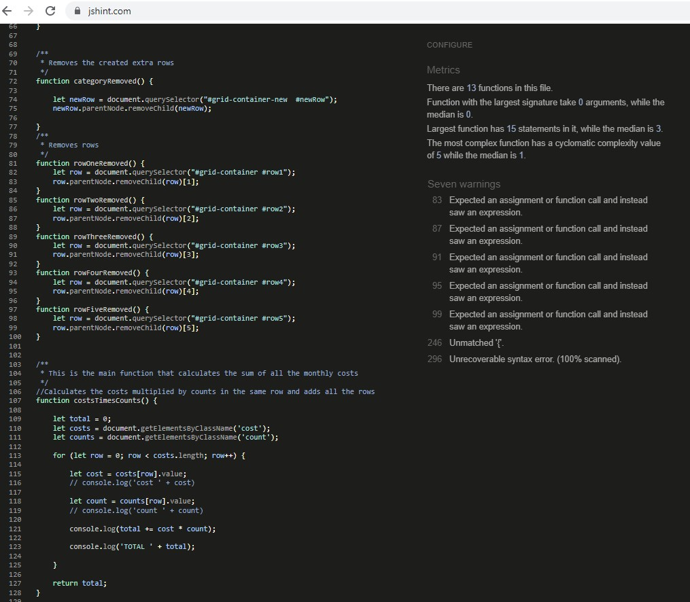

HTML - passed all tests

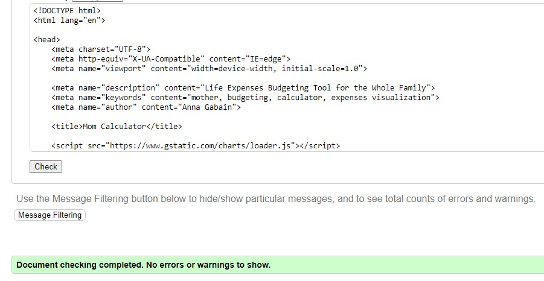

CSS -passed all tests

    

### LightHouse Report

The report shows the best results in Performance, Search Engine Optimization and Best Practices. Acessibility, however has proven difficult to improve despite of numerous efforts due to the layout nature of the calculator where the form labels appeared alianated from the form inputs, i.e. were placed on the top of the calculation area to avoid redundancy and save space for the mobile device width.

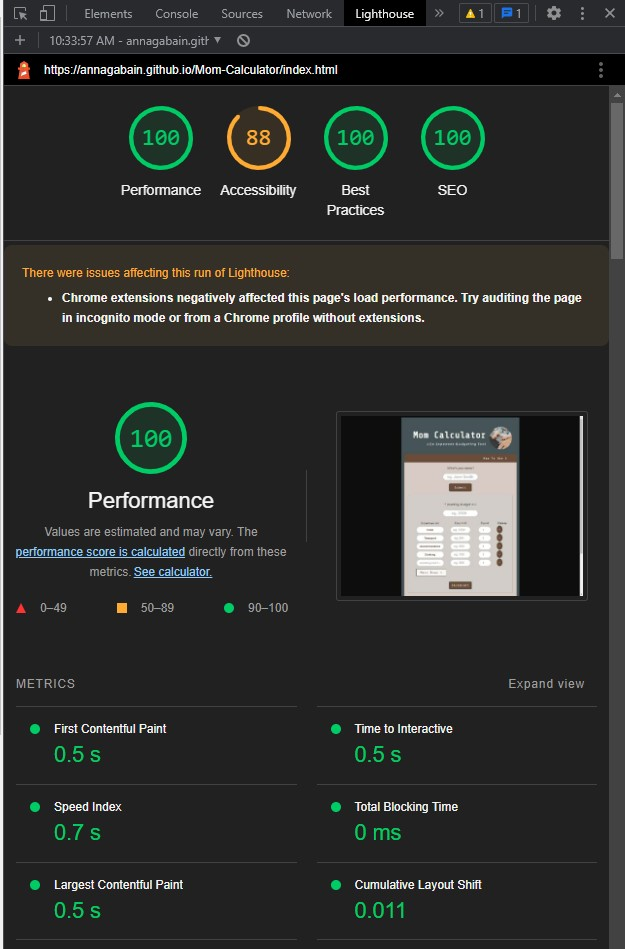

###  Remaining Bugs

The functions inside the JavaScript code have been working flowlessly during numerous testing sessions. However, jshint released the following warnings.

  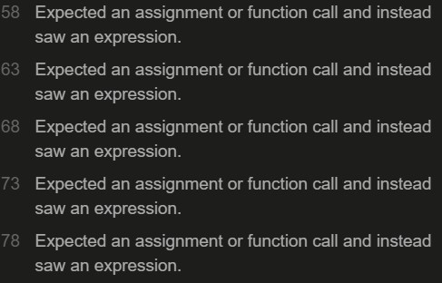

As mentioned above, several attemts to improve the Accessibility with labels created even more issues with labels, where the number of errors increased in contradiction to the expectation. A compromise was made to leave the viable result that is just a little bit lower (88) than the green indicator (90+).

  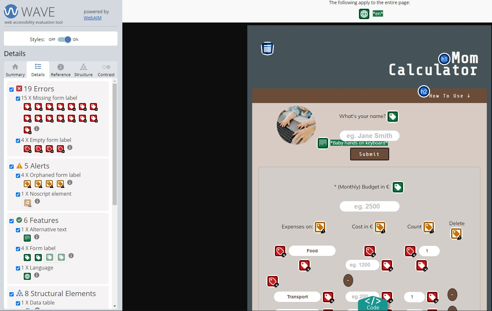

:point_up_2: [Back to Contents](#contents) 

## Deployment

### GitHub Pages

The project has been deployed to the Github version control system throughout the whole process - from the initial idea to submission. The website was published for live view with Github pages.
https://annagabain.github.io/Mom-Calculator/index.html

## Sources & Credits

###   Idea Inspiration

https://www.brutto-netto-rechner.info/

https://statsskuld.se/en/jobs/net-salary

### Tutorials

Grid layout creation: https://www.youtube.com/watch?v=jV8B24rSN5o

###   Images

Baby hands on kewboard: pexels-karolina-grabowska-4959738

### Tools

Google Charts for visualization: https://developers.google.com/chart

Contrast check with: https://webaim.org/resources/contrastchecker/

HTML Validator: https://validator.w3.org/

CSS Validator: https://jigsaw.w3.org/css-validator/

JavaScript Validator: https://jshint.com/

Chrome Developer Tools

## Acknowledgemts

Richard Wells - course mentor for feedback on the project

Jakob Lövhall - for guiding to detect the query selectors necessary for the main functions

Jamie King - course collegue for helping with the project idea discussions and technical details such as activating es6 in JSHint

David Reynolds - course collegue to check up on the project progress and share similar experiences with JS learning

Frances Boyle - course collegue to inspire and discuss progress

:point_up_2: [Back to Contents](#contents) 
