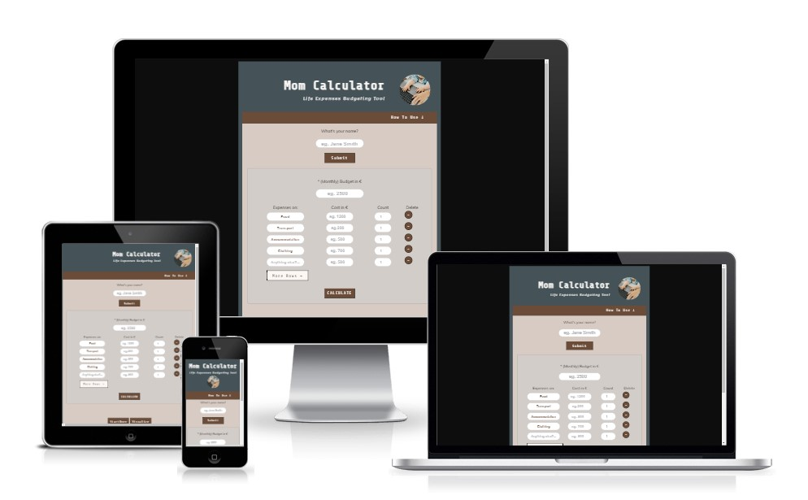

# Mom Calculator

## Life Expenses Budgeting Tool for the Whole Family

Mom Calculator is a website presenting an easy-to use budget calculation tool to family budget keepers. It aims to provide a clear overview on their monthly/yearly expenses to simplify budgeting tasks. Mom Calculator can be useful for any other type of periodic expense calculations as well.

Mom Calculator is a fully-responsive Javascript application. Users can input, modify and manipulate numbers by adding and removing relevant expense categories. The visualisation and results sections represent easily digestible data representations that lead to insights and keeping track of the life costs.

# Live View

:point_down: Click on the link below for the live view: 

https://annagabain.github.io/Mom-Calculator/index.html

## Contents:
- [Features](#features)
- [Development Stages](#development-stages)
- [Accessibility and Responsivity](#accessibility-and-responsivity)
- [Testing](#testing)
- [Deployment](#deployment)
- [Sources & Credits](#sources--credits)
- [Acknowledgemts](#acknowledgemts)

## Features

### Features Overview

- User can create a username
- The ability to manupulate numbers
- Feedback - input results table and listing
- Colours to support calculation outcome - balance green blue red 
- Pie Chart to represent the data in easily digestible manner

###  Heading

  

###  How to Use

  

###  Username

  

  

###  Calculator

  

  

  

:point_up_2: [Back to Contents](#contents) 

###  Visualization Area

  

###  Results Area

  

###  Contact form and Thank you for Contacting Area

   

   

###  Footer

   

###  404 Error Page

   

:point_up_2: [Back to Contents](#contents) 

## Development Stages

###  Planning

  

###  Layout Creation

 
  

###  User Experience and User Interface Design UX and UI

    -   Scribbles and Wireframes

  

    -  Colours

     Taken from the previous project: https://github.com/annagabain/Mom-Lifehacks

  

:point_up_2: [Back to Contents](#contents) 

## Accessibility and responsivity

###  Accessibility

  

###  Responsivity

## Testing

###  Validators

JS

HTML

CSS

    

### LightHouse Report

###  Remaining Bugs

  
  
  

:point_up_2: [Back to Contents](#contents) 

## Deployment

### GitHub Pages

https://annagabain.github.io/Mom-Calculator/index.html

## Sources & Credits

###   Idea Inspiration

https://www.brutto-netto-rechner.info/

https://statsskuld.se/en/jobs/net-salary

### Tutorials

https://www.youtube.com/watch?v=jV8B24rSN5o

###   Images

Baby hands on kewboard: pexels-karolina-grabowska-4959738

## Acknowledgemts

Jakob Lövhall - for guiding to detect the query selectors necessary for the main functions

Richard Wells - course mentor for feedback on the project

Jamie King - course collegue for helping with the project idea discussions and technical details such as activating es6 in JSHint

David Reynolds - course collegue to check up on the project progress and share similar experiences with JS learning

Fran Boyle - course collegue to inspire and discuss progress

:point_up_2: [Back to Contents](#contents) 
